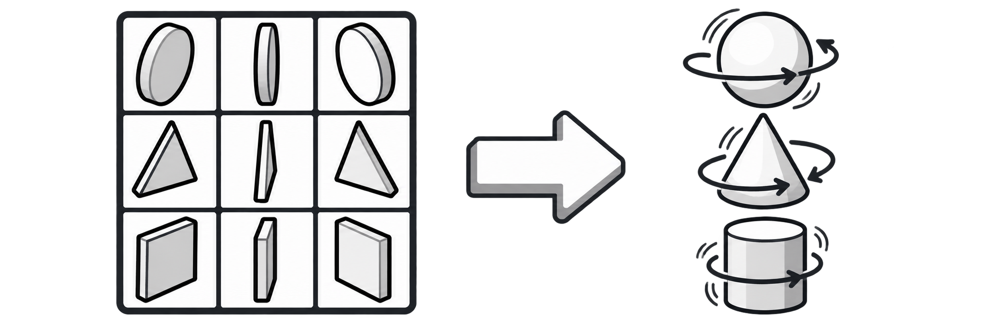

# SpriteFrames Batch Importer

**English** | [简体中文](README.zh-CN.md)

<p align="center">
  
</p>

<p align="center">
  A Godot 4 editor plugin for turning rule-based sprite sheets into named <code>SpriteFrames</code> animations.
</p>

<p align="center">
  <a href="https://youtu.be/MlzD47Uo8uo">
    
  </a>
  <br>
  <a href="https://youtu.be/MlzD47Uo8uo">▶ Watch the workflow demo on YouTube</a>
</p>

Godot 4 editor dock for generating named `SpriteFrames` resources from rule-based sprite sheets.

The dock includes Chinese and English UI, a zoomable live sprite-sheet preview with colored frame selections, visual state rows, visual direction rows, add/remove buttons, loop toggles, frame counts, and optional explicit start columns. Overlapping state selections use contrasting colors plus a white cross marker. Changes in the dock are reflected in the preview immediately.

## Install

Copy this directory to:

```text
res://addons/spriteframes_batch_importer/
```

Enable **SpriteFrames Batch Importer** under **Project > Project Settings > Plugins**.

## Visual configuration

1. Select a sprite sheet in Godot's FileSystem dock, then click **Use selected Sprite Sheet** in the importer.
2. Set the cell size, margins, and spacing.
3. Add or remove state cards and configure name, frame count, looping, and start column.
4. Add or remove directions and configure their row indices.
5. Expand the preview panel, zoom between 25% and 1600%, and verify the colored selections. The preview updates while settings are edited.
6. Enter a `res://` `.tres` output path and generate the `SpriteFrames` resource.

Column and row values are zero-based. Use `0` for the first column or row in the sheet. The frame number in validation messages is one-based, matching the number a user would normally count.

After selecting a sheet, the output path defaults to the same directory, using the source file name with `_frames.tres` appended. For example, `res://art/Mushrooms_16x16.png` becomes `res://art/Mushrooms_16x16_frames.tres`.

Output paths must be inside `res://` and use the `.tres` extension. The plugin creates a missing output directory when possible and checks that the output location is writable before generation. If a `.tres` file already exists, a confirmation is required and all of its animations are replaced. Existing files that are not `SpriteFrames` resources are never overwritten.

The default animation speed is 8 FPS (0.125 seconds per frame). FPS affects playback in the generated `SpriteFrames`; it does not animate the colored slice preview.

Every state uses the default FPS initially. Clear **Use Default FPS** on a state card to enter a state-specific speed. That speed applies to every direction generated for the state; for example, all `attack_*` animations share the Attack state FPS.

## Configuration format

Internally, each visual state represents:

```text
name,frame_count,loop[,start_column]
```

Example:

```text
idle,4,true
walk,4,true
attack,4,false
hit,4,false
death,4,false
```

When `start_column` is omitted, states are placed sequentially from `Base Column`. Use an explicit fourth value for gaps or irregular state positions:

```text
idle,4,true,0
walk,6,true,5
attack,3,false,12
```

Direction definitions use:

```text
name,row
```

Example (row indices are zero-based):

```text
down,1
left,2
right,3
up,4
```

If the sprite sheet has no header row, the first direction normally starts at row `0`. If it has one header row, the first direction normally starts at row `1`.

The generated animation names are `state_direction`, such as `walk_left`.

## Supported layouts

The first version supports sheets where animation states occupy horizontal column ranges and directions occupy configurable rows. Margins, spacing, frame size, base column, explicit state start columns, FPS, and looping are configurable.

Fully scattered frames, rotated frames, packed texture atlases, or sheets where each animation follows unrelated geometry require explicit per-frame mapping and are intentionally outside the fast rule mode.
